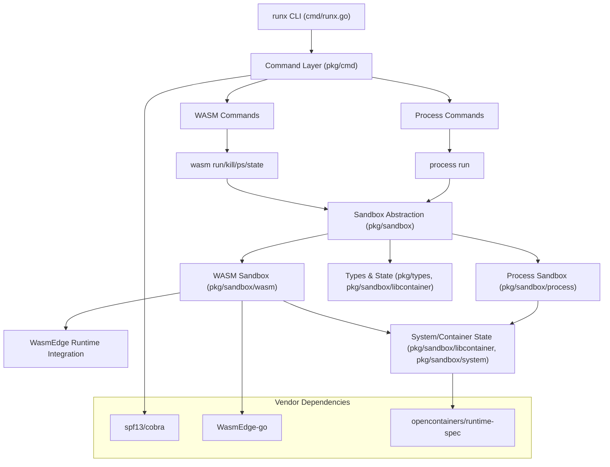

# runx

runx 是一个基于 Go 语言开发的 WebAssembly (WASM) 运行与管理命令行工具。它为 WASM 应用提供类似容器的运行环境，支持进程生命周期管理、状态查询等功能，适用于云原生、边缘计算等场景。

## 主要特性

- **WASM 进程管理**：支持启动、杀死、列出、查询 WASM 进程。
- **多运行时支持**：目前支持 WasmEdge，后续可扩展 WasmTime 等。
- **容器化沙箱**：为 WASM 应用提供隔离的运行环境。
- **命令行友好**：基于 spf13/cobra 实现，易于扩展和集成。

## 安装

```bash
git clone https://github.com/KubeFunction/runx.git
cd runx
make build
```

## 快速开始

```bash
# 运行 WASM 文件
./runx wasm run -f your_app.wasm

# 杀死 WASM 进程
./runx wasm kill -p <PID>

# 查看所有 WASM 进程
./runx wasm ps

# 查询进程状态
./runx wasm state -p <PID>
```

## 命令结构

- `wasm run`：启动 WASM 文件
- `wasm kill`：杀死指定 WASM 进程
- `wasm ps`：列出所有 WASM 进程
- `wasm state`：查询 WASM 进程状态
- `process run`：启动容器进程（预留/实验性）

## 架构图



## 依赖

- Go 1.20+
- [spf13/cobra](https://github.com/spf13/cobra) - 命令行框架
- [WasmEdge-go](https://github.com/second-state/WasmEdge-go) - WASM 运行时
- [opencontainers/runtime-spec](https://github.com/opencontainers/runtime-spec) - 容器运行时规范
- [k8s.io/klog](https://github.com/kubernetes/klog) - 日志库

## 目录结构

- `cmd/`：主程序入口
- `pkg/cmd/`：命令定义与参数解析
- `pkg/sandbox/`：沙箱与运行时实现
- `pkg/types/`：核心类型定义
- `vendor/`：依赖库

## 贡献

欢迎提交 issue 和 PR！